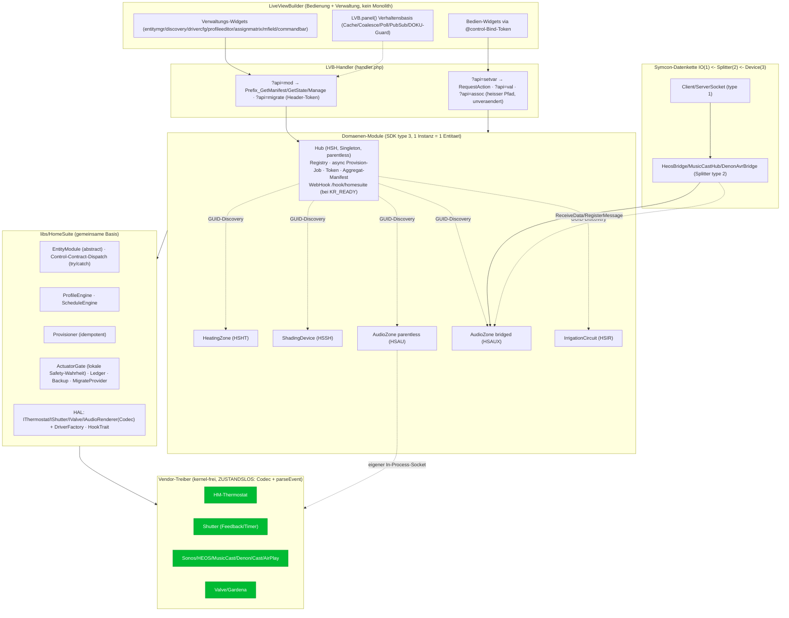

# HomeSuite — Finale Bau-Spezifikation (Kernel 9.0, MIT)

Dies ist das verbindliche, umsetzungsreife Bau-Dokument. Es integriert die drei Kritiken (SDK/Machbarkeit, Abstraktion/Audio/LVB, Stabilität/Migration/Security) und löst jede berechtigte Schwäche mit einer konkreten, belegten Entscheidung auf. Wo Kritiken Blocker markierten (F1/F2/F5, B1/A2, A–F der Stabilitätslinse), ist die Korrektur hier kanonisch. Struktur: dieselben acht Abschnitte, am Ende „Was die Kritik geändert hat".

---

## 1. Architektur-Überblick

### 1.1 Namens- und Repo-Entscheidung (kanonisch)

- **Repo = 1 Symcon-Library**, `library.json`, Lizenz **MIT**. Library-Name **HomeSuite**. `compatibility.version` = **exakt die niedrigste tatsächlich genutzte Kernel-API** (Baseline-Entscheidung in M0.1; Default-Zielkernel 9.0, aber wenn kein 9.0-only-API genutzt wird, wird die reale Mindestversion gesetzt — nicht pauschal „7.0", da sonst die Store-Installation auf älteren Kernen erst zur Laufzeit bricht). **[F11]**
- **Basis-Namespace `Hoep\HomeSuite\`** (vendor-eindeutig) unter `libs/HomeSuite/`. Grund: `libs/` hat kein PSR-4; ein generisches `Fabric\` würde beim parallelen Laden zweier Libraries mit gleichem Root im selben Kernel-Prozess kollidieren (`require_once` lädt die erste, die zweite erbt fremde Definitionen). Ein vendor-eindeutiger Root eliminiert das kostenlos. **[F7]** Ein `autoload.php` mit expliziten `require` (belegtes Store-Muster).
- **Modul-Prefixe (immutabel, in `GUIDS.md`):** Hub = `HSH`, HeatingZone = `HSHT`, ShadingDevice = `HSSH`, **AudioZone-parentless = `HSAU`**, **AudioZone-bridged = `HSAUX`** (§4.3), IrrigationCircuit = `HSIR`. Audio-Bridges (Splitter): `HSBH` (HEOS), `HSBM` (MusicCast), `HSBD` (Denon). Prefix_-Funktionsnamen sind kernelweit eindeutig — Prefixe bleiben stabil.
- **Idents/Profile prefix-namespaced** (`HSHT.Setpoint`, `HSSH.Movement`). Control-Idents sind kanonisch und stabil (Vertrag 1); `label` ist frei/lokalisierbar.

### 1.2 Vier Schichten + korrekte Datenkette



**Kette korrekt (F1):** Symcon erzwingt IO(1) ← Splitter(2) ← Device(3). Ein Device kann nie Parent eines IO/Splitter sein. Deshalb ist AudioZone stets **Kind** — entweder parentless mit eigenem In-Process-Socket (`HSAU`: Sonos SOAP-per-call, Cast/AirPlay lokaler Socket) oder Kind einer Bridge-Splitter-Instanz (`HSAUX` ← `HSBH/HSBM/HSBD`). Details §4.3.

### 1.3 Leitprinzipien

1. **Design & Stabilität vor Aufwand — „einmal richtig".** Wahrheit lebt an **einer** Stelle: Manifest (Bedienung+Verwaltung), Musterseite (N Detailseiten), Treiber (Gerätespezifika), `ActuatorGate` (reale Schreibbefehle **und lokale Safety-Wahrheit**).
2. **RequestAction ist der einzige autoritative Bedien-Eingang.** Kein Sender-Guard, keine Nachlogik im Schreibpfad.
3. **Drei alt vermischte Belange getrennt:** Wert setzen · Automatik-Hoheit (`manualHold`) · Provenienz (`ActionContext`).
4. **Vollständig im LVB verwaltbar.** Konsole nur einmalig (Library + Hub-Instanz).
5. **Strangler-Fig, produktiv-sicher.** Neu neben Alt (Schatten), granularer Per-Entität-Cutover, jederzeit rückrollbar, kein blindes Delete. **Aktor-Safety hat Vorrang vor Migrationskomfort** (§6/§7).
6. **Generisch statt Monolith.** Bestehende LVB-Widgets via Bind-Token wiederverwenden; nur wenige dünne, manifest-gerenderte Verwaltungs-Widgets + zwei Audio-Atome + **ein neuer HM-Wochenprofil-Editor** (ehrlich als Neubau ausgewiesen, §5.5/A2) sind neu.
7. **Immer über die HAL — nie direkt auf Vendor-Hardware.** Jede Domäne redet ausschließlich mit einem HAL-Interface (`IThermostat`/`IShutter`/`IValve`/`IAudioRenderer`); Gerätespezifika leben nur in austauschbaren Treibern. Für beliebige Hardware **ohne** Spezial-Treiber gibt es je HAL einen **generischen Variablen-Treiber**, der im LVB an Standard-Symcon-Variablen gebunden wird → die Suite läuft in jedem Haus, nicht nur im HomeMatic-Haus.

---

## 2. Die drei Verträge (formal)

### 2.1 Vertrag 1 — Control-Contract

**Modell:** Eine **Entität** = eine Modul-Instanz. Sie exponiert **typisierte Controls**; jedes Control bindet an genau eine Status-Variable (`ident`) und ist optional `actionable` (`EnableAction($ident)` → native `RequestAction`).

**Die 6 Control-Typen (geschlossen):**

| type | Bedeutung | actionable | Wert | Status-Variable | LVB-Vorauswahl |
|------|-----------|-----------|------|-----------------|----------------|
| `setpoint` | numerischer Zielwert | ja | float/int `min/max/step/unit` | ja | stepper/slider/tempbar |
| `switch` | boolean | ja | bool | ja | switch/tile |
| `level` | stetiger 0..100-Regler | ja | int/float 0..100 | ja | slider |
| `command` | momentaner/enum-Befehl | ja | enum-code | **ja, mit EnableAction** — Wert wird nach Ausführung auf idle (`-1`) zurückgesetzt | tile/commandbar/select |
| `reflect` | read-only Rückmeldung | nein | beliebig | ja (Anzeige) | value/valuecard/gauge/chart |
| `select` | Auswahl aus benannter Menge | ja | index/key in `options` | ja | select/assoc |

**Wichtig (F5):** „transient" bei `command` bedeutet **nicht** „keine Variable". `?api=setvar&id=<varId>`→`RequestAction($varId,$value)` funktioniert nur, wenn die Statusvariable existiert UND `EnableAction` gesetzt ist. Jedes actionable Control — auch `command` — hat daher eine Statusvariable mit `EnableAction`; das Manifest liefert für `command` eine echte `varId` (Bind `@cmd:` braucht sie ohnehin). Transient = der Wert wird nach `applyControl` auf einen Idle-Code zurückgeschrieben (kein Dauerzustand), die Variable bleibt bestehen.

**Regel:** Jede Domäne MUSS `Mode` (select), `ActiveProfile`/`ActiveProgram` (select, wo Profile existieren) und `Online` (reflect) anbieten.

**Kanonisches `role`-Vokabular — offen & namespaced (A1):** `role` ist ein **offener String `domain:slug`**, kein geschlossenes Enum. `ControlContract::isValidRole()` prüft nur das **Format** `^[a-z][a-z0-9]*:[a-z][a-z0-9-]*$`, nicht Mitgliedschaft — sonst könnte kein Fremd-Domänenmodul eine neue `role` einführen, ohne den Core zu patchen. Die folgende Tabelle ist Referenz-**Registry** (Doku), kein Enum:

| Domäne | ident (type/role) |
|--------|-------------------|
| Heizung | `Setpoint`(setpoint/`heating:target-temperature`) · `ActualTemp`(reflect/`heating:current-temperature`) · `Mode`(select/`heating:hvac-mode`) · `Presence`(select/`heating:presence`) · `ActiveProfile`(select/`common:active-profile`) · `Boost`(command/`heating:boost`) · `ValvePosition`(reflect/`heating:valve-position`) · `Humidity`(reflect/`heating:humidity`) · `DeviceSetpoint`(reflect/`heating:device-setpoint`) · `Online`(reflect/`common:online`) |
| Beschattung | `Position`(level/`shade:position` 0=offen/oben..100=zu/unten) · `PositionActual`(reflect/`shade:position-actual`) · `Movement`(command/`shade:move`) · `Slat`(level/`shade:slat`) · `Automatic`(switch/`shade:automatic`) · `Mode`(select/`shade:mode`) · `ProfileSun/Temp/Weather/Day/Night`(select) · `ManualChange`(reflect/`shade:manual-override`) · `State`(reflect/`shade:state-text`, kann `UNKNOWN` sein — §8/E) · `Online`(reflect) |
| Audio | `Transport`(command/`audio:transport`) · `TransportState`(reflect) · `Volume`(level/`audio:volume`) · `Mute`(switch/`audio:mute`) · `Position`(level/`audio:seek`) · `Duration`(reflect) · `Seekable`(reflect/`audio:seekable`) · `Input`(select/`audio:source`) · `Favorite`(select) · `RepeatMode`(select) · `Shuffle`(switch) · `NowTitle/Artist/Album/AlbumArt`(reflect) · `GroupRole/Coordinator/Members`(reflect) · `GroupVolume`(level) · `GroupJoin/Leave/Set`(command) · `Online`(reflect) |
| Bewässerung | `Valve`(switch/`irrigation:valve`) · `RunNow`(command/`irrigation:run-now`) · `Automatic`(switch) · `Duration`(setpoint/`irrigation:run-duration-min`) · `SeasonalAdjust`(level 0..200) · `Mode`(select) · `ActiveProgram`(select) · `Moisture`(reflect) · `Rain`(reflect) · `Running/LastRun/LitersToday`(reflect) · `Online`(reflect) |

**RequestAction-Dispatch (Basis, `final`, gekapselt):**

```
RequestAction($ident, $value):        # native Signatur ($Ident,$Value), KEINE Typehints
  try:
    c = control($ident)               # aus Manifest materialisiert
    if !c || !c.actionable: throw ContractException
    v = c.coerce($value)              # Typ + Range/Enum-Check
    ctx = ActionContext(source=user, ts=now)
    optimistic = c.optimistic()       # s.u. Reflect-Politik
    if c.type != command && isAutomated(c):
        manualHold($ident, holdSeconds())      # expliziter Zustand, keine Heuristik
    if optimistic: SetValue(c.varId, v)        # sofort setzen, manualHold-Fenster schuetzt
    applyControl(c, v, ctx)                     # Domaenen-Hook -> Treiber/Berechnung
    if c.type == command: resetCommand(c)       # Wert -> idle (-1)
    emitStateChanged($ident, v, ctx)
  catch (Throwable $e):
    $this->LogMessage('HS.RA '.$ident.': '.$e->getMessage(), KL_ERROR)
    # NIE nach oben werfen -> keine ungefangene Exception im ?api=setvar-Pfad / Kernel-Log
```

**Reflect-Politik (behebt „springt zurück", ohne neue Trägheit — F4):**
Optimistischer `SetValue` wird **nicht pauschal verboten**, sondern an `manualHold` gekoppelt:
- **Treiber mit echtem Push** (GENA/HEOS-unsolicited/MusicCast-UDP): `optimistic=false` — Wahrheit kommt schnell via `setReflect`, kein optimistisches Setzen nötig.
- **Treiber ohne Push** (HM, Sonos-Poll-Fallback 5/300 s, Timer-Rollo): `optimistic=true` — sofort `SetValue`, `manualHold`-Fenster öffnen; das nächste `setReflect` bestätigt oder revert nach `holdSeconds()`-Timeout kontrolliert. Ohne diese Kopplung kehrte exakt das „reagiert träge/springt zurück" zeitversetzt zurück.

`c.optimistic()` = `!driver.supportsPush()` für den betroffenen Ident (Default true bei fehlendem Treiber-Feedback).

### 2.2 Vertrag 2 — Manifest-JSON-Schema v1.0

`Prefix_GetManifest($id): string` (Struktur+state-Snapshot, gecacht) und `Prefix_GetState($id): string` (Live-Snapshot).

**Top-Level:**

```jsonc
{
  "manifestVersion": "1.0",
  "module":   { "id":"homesuite.heating.zone", "prefix":"HSHT", "domain":"heating",
                "guid":"{HS-HEATZONE-GUID}", "moduleType":3, "title":"Heizzone", "icon":"Temperature" },
  "instanceId": 45123,
  "capabilities": ["thermostat","schedule","profiles"],
  "entity":   { "id":"zone.bad_og", "name":"Bad OG", "singular":"Zone", "plural":"Zonen",
                "group":"OG", "roomRef":53700, "identNamespace":"HSHT" },
  // entity.id ist IMMUTABEL (renameEntity aendert nur name) -> Idempotenzschluessel (template,entity) bleibt stabil
  "controls":         [ /* §2.2.1 */ ],
  "profileTypes":     [ /* §2.2.2 */ ],
  "programTypes":     [ /* wie profileTypes, Semantik "Programm" */ ],
  "managementActions":[ /* §2.2.3 whitelist */ ],
  "configFields":     [ /* §2.2.4 */ ],
  "driverCatalog":    [ /* §2.2.5 */ ],
  "state":            { "Setpoint":21.5, "ActualTemp":20.8, "Mode":"auto", "Online":true }
}
```

**2.2.1 Control-Descriptor:**

```jsonc
{
  "ident":"Setpoint", "type":"setpoint", "role":"heating:target-temperature",
  "label":"Solltemperatur", "varType":2, "actionable":true, "varId":45001,
  "unit":"°C", "min":5, "max":30, "step":0.5, "dec":1,
  "profile":"~Temperature", "group":"climate", "requiresCap":"thermostat",
  "optimistic":true,                    // Reflect-Politik §2.1; false bei Push-Treibern
  "options":[ {"value":0,"key":"auto","label":"Auto","icon":"Gear"} ],
  "reflectOf":null
}
```

**2.2.2 profileTypes[] / programTypes[]:**

```jsonc
// Heizung: HM-Slot-Wochenplan, 2. Achse Praesenz — backing entscheidet den Editor-Pfad
{ "id":"roomProfile", "title":"Raumprofil", "editor":"weekedit-hm", "backing":"hmTempProfile",
  "axis2":{"key":"presence","options":["present","absent","night"]},
  "schema":{ "kind":"weekSlots",
             "value":{"type":"float","unit":"°C","min":5,"max":30,"step":0.5},
             "constraints":{"maxSlots":13,"rasterMinutes":5,"lastSlotFixed":"24:00"} } }
// HINWEIS (A2): editor "weekedit-hm" ist NICHT das Bestands-weekedit (das kann nur EventType 2).
//   Es ist die neu extrahierte HM-Editor-UI (§5.5), die op:updateProfile statt ?api=week fährt.

{ "id":"sunProfile", "title":"Sonnenprofil", "editor":"fields",
  "schema":{ "azimuthBgn":{"type":"int","min":0,"max":360},
             "azimuthEnd":{"type":"int","min":0,"max":360},
             "elevation":{"type":"int","min":0,"max":90} } }

{ "id":"scene", "title":"Szene", "editor":"fields",
  "schema":{ "source":{"type":"select","optionsRef":"favorites"},
             "volume":{"type":"int","min":0,"max":100},
             "members":{"type":"list","of":"entityRef"} } }

{ "id":"wateringProgram", "title":"Programm", "editor":"fields",
  "schema":{ "days":{"type":"boolArray","len":7},
             "starts":{"type":"list","of":{"time":"time","durationMin":"int"}},
             "seasonalAdjust":{"type":"int","default":100},
             "skipIfRain":{"type":"bool"}, "soilMoistureBelow":{"type":"int"} } }
```

**2.2.3 managementActions[]** — Whitelist für `Manage`; jede Aktion trägt ein Feld-Formular:

```jsonc
{ "op":"createEntity", "verb":"create", "target":"entity", "label":"Zone anlegen",
  "destructive":false,
  "fields":[ {"key":"name","type":"string","required":true,"maxLen":48},
             {"key":"driver","type":"driver","required":true},
             {"key":"target","type":"objid","required":true},
             {"key":"wandthermostatId","type":"objid","required":false} ] }
```
Verb-Vokabular: `createEntity | renameEntity | deleteEntity | moveEntity | createProfile | updateProfile | deleteProfile | duplicateProfile | assignProfile | setSchedule | setThreshold | setOrientation | addDriver | configureDriver | removeDriver | discover | pair | setConfig | regenerateViews`; Hub-only zusätzlich `provision | rotateToken | listSnapshots | restoreSnapshot`. Destruktive Verben (`deleteEntity`, `deleteProfile`, `restoreSnapshot`): `"destructive":true` → verlangen `confirm=1`.
**renameEntity** ändert ausschließlich `entity.name`, **nie** `entity.id`.

**2.2.4 Field-Schema** (gemeinsam `configFields` + `managementActions.fields`):

```jsonc
{ "key":"holdMinutes",
  "type":"string|int|float|bool|select|entityRef|driver|objid|color|time|profileRef|varpick",
  "label":"Manueller Vorrang (min)", "default":120,
  "min":null,"max":null,"options":[],"required":false,"maxLen":null,"regex":null,
  "help":"0 = bis zum naechsten Tag/Nacht-Wechsel" }
```

**2.2.5 driverCatalog[]:**

```jsonc
{ "id":"sonos", "title":"Sonos", "interface":"IAudioRenderer", "moduleFamily":"HSAU",
  "transport":"upnp-soap+gena", "session":"in-process", "bridge":null,
  "discovery":"ssdp:ZonePlayer:1", "maturity":"stable",
  "capabilities":["play","stop","nextprev","seek","volume","mute","input","favorites",
                  "playlists","playmode","grouping","group_volume","push","albumart","announce"],
  "groupWritable":true, "groupDomainTemplate":"sonos:{householdId}",
  "configFields":[ {"key":"host","type":"string","required":true},
                   {"key":"udn","type":"string","required":true} ] }
// moduleFamily = HSAU (parentless) | HSAUX (bridged); steuert, welche Instanz-GUID provisioniert wird (F1/§4.3)
```

**Forward-Compat:** Der LVB-Renderer überspringt unbekannte `control.type`/`role`/`field.type` **tolerant** (Default `value`/`text`, kein Abbruch), gesteuert über `manifestVersion`.

### 2.3 Vertrag 3 — IAudioRenderer (Codec) + AudioZone-Contract

**Kernkorrektur (B1):** Der Treiber ist ein **zustandsloser Protokoll-Codec** in `libs/HomeSuite/Drivers/Audio/` — er kennt nur das Vendor-Protokoll, hält **keinen** Socket, keine Session, keinen Zustand über Requests hinweg. Er wandelt Kommandos in Frames (per Callback `$send` rausgeschoben) und rohe Event-Frames in `AudioState`-Deltas (pure `parseEvent`). Socket, Verbindungszustand, Reconnect und Queue besitzt die **AudioZone-Instanz** (parentless: eigener Socket) bzw. die **Bridge** (Splitter: `ReceiveData`/`RegisterMessage`). Damit sind Sonos (SOAP-per-call, `$send`=HTTP-POST), HEOS/Cast (persistenter Socket in Bridge/Instanz) **und** Unit-Tests (Frame rein → `AudioState` raus) sauber tragbar.

```php
namespace Hoep\HomeSuite\HAL;

interface IDriver {                          // kernel-frei, zustandslos
  public function bind(array $config, callable $send): void; // $send($frameOrRequest): void
  public function capabilities(): AudioCapabilities;         // real verfuegbare Teilmenge
  public static function discover(int $timeoutMs=2000): array; // [{title,config{host,udn,model}}]
  public function poll(): array;             // liefert Request-Frame(s) fuer Snapshot (via $send auszuschieben)
  public function parseEvent(string $raw): ?AudioState;      // PURE: Frame -> Delta (oder null)
}

interface IAudioRenderer extends IDriver {   // v1-CORE (nur was aufrufbar ist — B3)
  // Transport (erzeugen Frame(s) via $send)
  public function play(): void; public function pause(): void; public function stop(): void;
  public function next(): void; public function previous(): void; public function seek(int $sec): void;
  // Lautstaerke (normalisiert 0..100). setVolume adressiert IMMER den einzelnen Renderer (B5)
  public function setVolume(int $pct): void; public function setMute(bool $on): void;
  // Quelle / Inhalt
  public function selectInput(string $inputId): void;
  public function playSource(AudioSourceRef $ref): void;     // favorite|playlist|station|uri|preset
  public function playAnnouncement(string $uri, int $volume=0): void;  // CAP_ANNOUNCE
  public function setPlayMode(int $repeat, bool $shuffle): void;
  public function listFavorites(): array; public function listPlaylists(): array;
  public function browse(string $containerId, int $offset, int $limit): AudioBrowseResult;
  // Gruppierung: EINE autoritative, deklarative Op (B2)
  public function setGroupMembers(string $coordinatorUid, array $memberUids): void;
  public function setGroupVolume(int $pct): void;            // adressiert den Koordinator (B5)
}

// v1.1 (spaeter, mit passenden Methoden — B3):
interface IAudioRendererExtended extends IAudioRenderer {
  public function addToQueue(AudioSourceRef $ref): void; public function clearQueue(): void;   // CAP_QUEUE
  public function setTone(array $bands): void;                                                  // CAP_TONE
  public function setSleepTimer(int $minutes): void;                                            // CAP_SLEEPTIMER
}
```

**Entfernt aus dem Treiber (B1):** `connect/disconnect/getConnectionState/subscribe/supportsPush/nowPlaying`. Verbindungszustand liefert die Instanz/Bridge über eine `Connection`-reflect-Variable; Push ist implizit (Bridge liefert Frames an `parseEvent`).

**Value Objects & Enums** (`libs/HomeSuite/Drivers/Audio/types.php`):

```php
final class AudioState {                     // alle Felder nullable => Delta-faehig
  public ?int $transportState;              // TS_STOPPED|PLAYING|PAUSED|BUFFERING|TRANSITIONING
  public ?int $volume; public ?bool $mute;
  public ?string $title, $artist, $album, $albumArtUrl;
  public ?int $positionSec, $durationSec; public ?bool $seekable;   // B6
  public ?int $repeatMode; public ?bool $shuffle;
  public ?string $sourceName, $inputId;
  public ?int $groupRole;                   // GR_STANDALONE|COORDINATOR|MEMBER
  public ?string $groupCoordinatorUid; public ?array $groupMemberUids; public ?int $groupVolume;
  public ?int $connection; public ?string $lastError;
}
final class AudioCapabilities {
  public int $flags; public array $inputs; public string $groupDomain;
  public bool $groupWritable;               // B5: Cast/AirPlay melden Gruppen, setzen sie nicht
  public string $maturity;
}
final class AudioSourceRef  { public string $kind, $id; public ?string $title, $uri;
  public array $vendorMeta=[]; }            // B4: undurchsichtiger Treiber-privater Blob statt metaDidl
final class AudioBrowseResult { public array $items; public int $total, $offset; }
// TS_STOPPED0 PLAYING1 PAUSED2 BUFFERING3 TRANSITIONING4 · REPEAT_OFF0 ONE1 ALL2 · GR_STANDALONE0 COORDINATOR1 MEMBER2
// CONN_ (Instanz-Ebene): DISCONNECTED0 CONNECTING1 CONNECTED2 ERROR3 UNAVAILABLE4
// CAP_ Bitflags v1-CORE: PLAY1<<0 STOP1<<1 NEXTPREV1<<2 SEEK1<<3 VOLUME1<<4 MUTE1<<5 INPUT1<<6
//   BROWSE1<<7 FAVORITES1<<8 PLAYLISTS1<<9 PLAYMODE1<<11 GROUPING1<<12 GROUP_VOLUME1<<13
//   METADATA1<<15 ALBUMART1<<16 ANNOUNCE1<<19
//   (GESTRICHEN in v1: QUEUE1<<10, TONE1<<17, SLEEPTIMER1<<18 -> erst v1.1 mit Methoden)
// ERR_ TRANSPORT1 UNSUPPORTED2 VENDOR3 TIMEOUT4 NOTGROUPLEADER5  (throw AudioDriverException)
```

**AudioZone-Contract** — Idents → Treiber-Calls (nur bei gesetzter Capability):

| Ident | Typ | Wert | Treiber-Call | Cap |
|---|---|---|---|---|
| `Transport` | command | 0=stop,1=play,2=pause,3=next,4=prev | play/pause/stop/next/previous | PLAY/STOP/NEXTPREV |
| `Volume` | level | 0..100 | setVolume (einzelner Renderer) | VOLUME |
| `Mute` | switch | bool | setMute | MUTE |
| `Position` | level | sec | seek (nur wenn `Seekable`) | SEEK |
| `RepeatMode`/`Shuffle` | select/switch | – | setPlayMode | PLAYMODE |
| `Input`/`Favorite` | select | id | selectInput / playSource | INPUT / FAVORITES |
| `GroupJoin`/`GroupLeave`/`GroupSet` | command | uid / – / [uids] | **Controller übersetzt → setGroupMembers-Delta** (B2) | GROUPING (writable) |
| `GroupVolume` | level | 0..100 | setGroupVolume (Koordinator) | GROUP_VOLUME |
| reflect (`TransportState/Duration/Seekable/Now*/SourceName/Group*/Connection`) | – | – | nur `setReflect` | – |

`GroupJoin/Leave` sind **nur AudioZone-Controls**; der Hub/AudioController liest die aktuelle Topologie und ruft **eine** `setGroupMembers(coordinatorUid, memberUids±self)`. `unjoin` = `setGroupMembers(selfUid,[selfUid])`. `RequestAction` schreibt bei Push-Treibern nie optimistisch (reflect), bei Poll-Treibern optimistisch+Hold (§2.1). Fehler → `LastError` + Log.

**AirPlay2 / read-only-Cast (B7):** sind **reine Reflect-Beobachter** — `capabilities()` liefert praktisch nur `METADATA`(+`ALBUMART`), `groupWritable=false`; alle Transport/Volume-Idents werden **nicht registriert** (nicht „mit ERR_UNSUPPORTED bedienbar"). Manifest `maturity:"experimental"`.

---

## 3. libs/HomeSuite — gemeinsame Basis

```
libs/HomeSuite/
  autoload.php
  EntityModule.class.php  Control.class.php  ControlContract.class.php  ActionContext.class.php
  Manifest.class.php      Store.class.php     Provisioner.class.php      HookTrait.php
  ProfileEngine.class.php ScheduleEngine.class.php
  Migration/ ActuatorGate.php  Ledger.php  Backup.php  MigrateProvider.php
  HAL/ IDriver.php IThermostat.php IShutter.php IValve.php IAudioRenderer.php DriverFactory.php
  Drivers/ Heating/ Shading/ Audio/ Irrigation/
```

```php
namespace Hoep\HomeSuite;

abstract class EntityModule extends \IPSModule {
  use HookTrait;                            // RegisterHook erst bei KR_READY (F3)
  public function Create();                 // RegisterAttributeString('FabricStore','{}'); RegisterMessage(0,IPS_KERNELMESSAGE); Timer; Token nur Hub
  public function ApplyChanges();           // manifest() -> Controls materialisieren, EnableAction (auch command!), Treiber binden, Timer; Hook falls Kernel bereits ready
  public function MessageSink($t,$sender,$msg,$data); // KR_READY -> registerHook()
  public function GetConfigurationForm();   // nur "Verwaltung im LiveViewBuilder" + Notfall-Advanced

  // Vertrag 1 — final dispatch (gekapselt, wirft nie nach oben — F4)
  abstract protected function manifest(): array;
  final public function RequestAction($Ident, $Value);   // native Signatur, ohne Typehints
  abstract protected function applyControl(Control $c, $value, ActionContext $ctx): void;

  // Drei oeffentliche RPC (-> HSHT_GetManifest etc.)
  public function GetManifest(): string;
  public function GetState(): string;
  public function Manage(string $requestJson): string;   // {op,args,dryrun?,confirm?,baseVersion?}

  // Domaenen-Helfer
  protected function control(string $ident): ?Control;
  protected function setReflect(string $ident, $value): void; // SCHREIBT STATUSVARIABLE, NIE FabricStore (Blocker D)
  protected function driver(): ?HAL\IDriver;
  protected function store(): Store;                      // nur Konfig/Profile (selten)
  protected function profiles(): ProfileEngine;
  protected function schedules(): ScheduleEngine;
  protected function manualHold(string $ident, int $seconds): void; // in RegisterAttribute (volatil), nicht FabricStore
  protected function isManuallyHeld(string $ident): bool;
  protected function isAutomated(Control $c): bool { return false; }  // BASIS-DEFAULT false (A3) — Domaene ueberschreibt
  protected function holdSeconds(): int;
  protected function emitStateChanged(string $ident, $value, ActionContext $ctx): void;
  protected function mgmt(string $op, array $args, array $ctx): array;
  // Timer-Callbacks: public (SDK-Zwang) aber als __TimerCb benannt und NIE als Manage/Handler-Verb zulassen (F10)
  public    function __TimerCb(string $job): void;
  public    function ImportLegacy(array $spec): array;    // idempotent, kein Geraeteschreiben
}

final class Control {
  public string $ident,$type,$role,$label; public int $varType; public bool $actionable,$optimistic;
  public ?float $min,$max,$step; public ?int $dec,$varId; public ?string $unit,$profile,$group,$requiresCap,$reflectOf;
  public array $options;
  public static function fromArray(array $a): self;
  public function coerce($v);              // cast + Range/Enum, wirft \Hoep\HomeSuite\ContractException
  public function optimistic(): bool;      // = !driverSupportsPush(ident)
  public function toArray(): array;
}

final class ControlContract {
  const T_SETPOINT='setpoint',T_SWITCH='switch',T_LEVEL='level',T_COMMAND='command',T_REFLECT='reflect',T_SELECT='select';
  public static function isValidType(string $t): bool;
  public static function isValidRole(string $r): bool;    // FORMAT-Pruefung ^[a-z][a-z0-9]*:[a-z][a-z0-9-]*$ (A1), keine Mitgliedschaft
}

final class ActionContext { public string $source; public int $ts; public array $meta;
  public function __construct(string $source,int $ts=0,array $meta=[]); }

final class Store {                        // JSON auf Attribut "FabricStore" — NUR Konfig/Profile; Schreiben serialisiert (Semaphore)
  public function __construct(\IPSModule $m,string $attr='FabricStore');
  public function get(string $path,$default=null); public function set(string $path,$value): void;
  public function patch(string $path,array $partial): void; public function all(): array;
}

final class Provisioner {                  // IPSInstaller-Nachfolger, idempotent (nur anlegen wenn fehlt)
  public function __construct(int $rootId);
  public function category(string $path): int;
  public function variable(int $parent,string $ident,string $name,int $type,?string $profile=null): int;
  public function profileFloat(string $name,string $unit,float $min,float $max,float $step,int $dec,string $icon=''): void;
  public function profileAssoc(string $name,array $assoc,int $type=1): void;
  public function link(int $parent,int $target,string $name): int;
  public function instance(string $moduleGuid,int $parent,string $name,array $props=[]): int; // + ConnectParent bei Splitter-Kind (F6)
  public function purge(int $id): void;
}

final class ProfileEngine {                // Anlegen/Bearbeiten/Zuweisen GETRENNT
  public function __construct(Store $s,array $profileTypes);
  public function list(string $type): array;
  public function create(string $type,string $name,array $fields=[]): void;
  public function rename(string $type,string $old,string $new): void;
  public function duplicate(string $type,string $src,string $new): void;
  public function delete(string $type,string $name): void;
  public function get(string $type,string $name): array;
  public function setFields(string $type,string $name,array $fields): void;   // gegen schema validiert
  public function assign(int $entityId,string $type,string $name): void;
  public function assignedName(int $entityId,string $type): ?string;
}

final class ScheduleEngine {
  public function __construct(Store $s);
  public function getSlots(string $variant,int $day): array;
  public function setSlots(string $variant,int $day,array $slots): void;      // sortiert+validiert
  public function eval(int $ts,string $variant);                             // aktiver Slot-Wert (DETERMINISTISCH, saisonunabhaengig — Basis fuer Heizungs-verify, Blocker C)
  public function evalGeo(float $az,float $el,float $bright,array $geoProfile);
  public function toHomematicWeek(string $variant,int $rasterMin=5,int $slotLimit=13): array;
  // Beschattung: deklarative, getierte Rule-Kaskade (Blocker B)
  public function evalRules(array $ruleset, array $ctx): ?int;               // erste ?int != null gewinnt; Safety-Tier ignoriert manualHold
}
```

**Migration/ActuatorGate — lokale Safety-Wahrheit (Blocker A/I):**

```php
namespace Hoep\HomeSuite\Migration;

final class ActuatorGate {                 // je physischem Aktor EIN Gate; Zustand LOKAL im Modul-Attribut
  const SUSPEND=0, SHADOW=1, LIVE=2;
  public function __construct(int $actuatorId, string $semName);  // semName = Alt-Namensraum (s.u.)
  public function mode(): int;             // faellt bei unlesbarem Zustand auf SUSPEND (fail-safe)
  public function setMode(int $m): void;
  // JEDER reale Schreibbefehl laeuft hier durch. Solange die Domaene nicht 'retired' ist,
  // benutzt das Gate fuer Beschattungs-Aktoren IPS_SemaphoreEnter('IPSShadowing_Refresh',...) —
  // DENSELBEN Namen wie der Altregler (Blocker A). Non-blocking-Timeout, verworfener Befehl -> Log.
  public function write(callable $doWrite): bool;  // false + Log bei SUSPEND / Semaphor-Timeout
}

final class Ledger {                       // reine ORCHESTRIERUNGSSICHT, NIE Freigabequelle fuer Fahrbefehl (Blocker I)
  // redundant: Modul-Attribut + Backup-Datei je Transition
  public function set(string $entityId, int $phase): void;
  public function get(string $entityId): int;
  public function all(): array;
}

final class Backup {
  public function snapshot(array $objectIds, array $extra): string;  // kanonisch, inkl. eventActive+oldAutomatic (Blocker H) + globale Konfig-Kategorie (G3)
  public function restore(string $file): void;                       // stellt eventActive/oldAutomatic ZUERST wieder her
}

final class MigrateProvider {
  // plan/apply/verify/cutover/rollback/retire/status
  public function plan(string $domain): array;   // {baseVersion, planHash, report, warnings}  (Blocker F)
  public function apply(string $domain, string $planHash, string $baseVersion, string $confirm): array;
  // ...
  public static function canonicalSubtree(array $ids): string;  // sortierte Keys, keine Timestamps, IDs numerisch sortiert
}
```

**HAL-Interfaces (Nicht-Audio):**

```php
namespace Hoep\HomeSuite\HAL;

interface IThermostat extends IDriver {
  // caps: {scheduleMode:'device'|'controller', maxSlots:int, rasterMinutes:int, deviceProfiles:int,
  //        separateSensor:bool, p1Prefix:bool, hasMode:bool, hasHumidity:bool}
  public function capabilities(): array;                 // Modul entscheidet daran: device- vs controller-Zeitplan
  public function readLive(): array;                     // ['actual'=>?float,'setpoint'=>?float,'humidity'=>?int,'valve'=>?int]
  public function setSetpoint(float $c): bool;           // clamp; scheduleMode 'device' = Override-Fenster (A), 'controller' = laufender Sollwert
  public function setMode(string $mode): void;           // auto|manual|boost|frost (nur wenn caps.hasMode)
  // NUR bei scheduleMode=='device' (Geraet fuehrt das Wochenprofil selbst, z.B. HomeMatic, MAX!, viele Z-Wave):
  public function readWeekProfile(?int $presenceIndex=null): array;              // vom GERAET zuruecklesen (Migration-Wahrheit, G1)
  public function writeWeekProfile(array $week, ?int $presenceIndex=null): bool;  // z.B. -> HMXML_setTempProfile
  // Bei scheduleMode=='controller' (dummer Thermostat: nur Sollwert) faehrt die ScheduleEngine im Modul den
  // Zeitplan und ruft an jeder Slot-Grenze setSetpoint() — kein Geraeteprofil, kein Vendor-Code noetig.
}
interface IShutter extends IDriver {
  // caps: {positionFeedback:bool, absolutePosition:bool, slat:bool, shadowingType:0|1|2}
  const POS_UNKNOWN = -1;                                // Blocker E
  public function moveTo(float $percent): bool;          // 0=offen/oben..100=zu/unten; VERWEIGERT bei readPosition()==POS_UNKNOWN
  public function move(string $dir): bool;               // up|down|stop — einzig erlaubt bei UNKNOWN
  public function readPosition(): int;                   // POS_UNKNOWN wenn kein Feedback/nach Cutover
  public function referenceRun(string $dir): bool;       // nur auf OPERATOR-Kommando, wetter-gegatet (Blocker E)
  public function setSlat(float $percent): bool;
}
interface IValve extends IDriver {
  public function open(): bool; public function close(): bool;
  public function isOpen(): ?bool; public function pulse(int $seconds): bool; public function flow(): ?float;
}
final class DriverFactory { public static function create(string $driverId, array $config, ?callable $send=null): IDriver; }

// GENERISCHE VARIABLEN-TREIBER (je HAL, kein Vendor-Code): binden an vom Nutzer im LVB zugeordnete
// Standard-Symcon-Variablen und erfuellen damit dasselbe Interface wie Spezial-Treiber.
//   GenericVariableThermostat  scheduleMode:'controller'  cfg{setpointVarId(+Action), actualVarId, modeVarId?}   -> KNX/Z-Wave/Zigbee2MQTT/Shelly TRV/...
//   GenericVariableShutter     cfg{positionVarId(+Action) ODER upVarId/downVarId/stopVarId, feedbackVarId?}      -> beliebige Rollo-Aktoren
//   GenericVariableValve       cfg{switchVarId(+Action), flowVarId?}                                              -> beliebiges Relais/Ventil
// Spezial-Treiber (HomeMatic-Geraeteprofil, Cloud wie Tado) nur dort, wo das Geraet mehr kann als eine Sollwert-Variable.

// Reine, testbare Funktionen (kein IPS):
// Hoep\HomeSuite\ShadeKinematics::steps(int $fromPct,int $movementTarget,array $timings): Step[]
```

---

## 4. Domänen-Module

Jedes Domänen-Modul ist `type 3`, erbt `\Hoep\HomeSuite\EntityModule`. **1 Instanz = 1 Entität**, eigene GUID. Treiber sind **kernel-freie PHP-Codec-Klassen** (kein Instanz-Wildwuchs), referenziert per `driver`+`target`.

### 4.1 HeatingZone (`HSHT`, `{HS-HEATZONE-GUID}`)

- **Controls** §2.1; Solltemp-Clamp **5.0–30.0 °C**. `isAutomated()` → true nur für `Setpoint`/`Mode` (Hold-relevant), nicht für reflect.
- **profileType `roomProfile`:** 2 Achsen Präsenz(3)×Wochentag(7), Slots `{end,val}`, letzter `24:00`, aufsteigend. `maxSlots`/`rasterMinutes` aus `IThermostat::capabilities()`.
- **Zwei Thermostat-Klassen (über `capabilities().scheduleMode`):** `'device'` = Gerät führt das Wochenprofil selbst (HomeMatic/MAX!/viele Z-Wave) → Modul delegiert `writeWeekProfile`; `'controller'` = dummer Sollwert-Thermostat (KNX/Zigbee/MQTT/…) → **`ScheduleEngine` im Modul** fährt den Zeitplan und schreibt an Slot-Grenzen `setSetpoint`. Manifest/Editor/Musterseite bleiben identisch — nur der Treiber unterscheidet sich.
- **Treiber-Katalog (`IThermostat`):** `hm-HM-TC-IT-WM-W-EU`{device,13,5,3} · `hm-HM-CC-RT-DN`{device,13,10,1} · `hm-HM-CC-TC`{device,13,10,1,separateSensor:true} — HM-Adapter kapselt `HMXML_setTempProfile($devId,$week,$WT_Profil)`: bei `deviceProfiles=3` alle 3 Präsenzprofile, sonst nur aktive Präsenz; `P1_`-Prefix-Erkennung; getrennter Fühler (`wandthermostatId`) für Ist/Feuchte; vor Schreiben clampen/rastern; nie `die()` — bool+Log. **Plus `generic-thermostat`{controller}** (Bindung an Soll/Ist/Modus-Variablen, ScheduleEngine-getrieben) → deckt beliebige Fremd-Thermostate ohne Vendor-Code ab.
- **`setSetpoint`-Semantik (Entscheidung A, §8):** temporäres Override-Fenster (HM-Manual/Boost), nicht Profilüberschreibung; Read-back-Toleranz konfigurierbar.
- **managementActions:** `createEntity(name,driver,target,wandthermostatId?)` · `renameEntity` · `deleteEntity` · `configureDriver` · `updateProfile(presence,week[7])` · `duplicateProfile` · `assignProfile` · `setActivePresence`.
- **Migration (Eigenbau #<ID>/#<ID>):** Konfig via **`include` in isoliertem Scope** (nicht Regex — G1); aktives Profil zusätzlich **aus dem Gerät** zurücklesen (`readWeekProfile`), `plan` gibt **Konfig-vs-Gerät-Diff** als Warnung aus, **Wahrheit = Gerät**. `HMWochenprofilDaten`→`{end,val}`; `HMPraesenzProfilAuswahl`→`Presence`. Kein Geräteschreiben. **verify berechnungsbasiert** (§7-Phase 1).

### 4.2 ShadingDevice (`HSSH`, `{HS-SHADEZONE-GUID}`)

- **Controls** §2.1. Position **0=offen/oben, 100=zu/unten (FIX)**. `State` kann `UNKNOWN` sein.
- **HAL `IShutter` + ShadeKinematics:** Absolutposition → `moveTo()`; ohne Feedback → `ShadeKinematics::steps()`. **UNKNOWN-Position (Blocker E):** nach Cutover/Neustart ist Position `POS_UNKNOWN`; `moveTo` verweigert, nur `move(up|down|stop)` erlaubt; Kalibrierung ausschließlich per **operator-kommandierter, wetter-gegateter `referenceRun`** — niemals automatisch beim Cutover. Bis dahin bleibt Alt Wahrheit, Gate liefert `state:UNKNOWN` an den LVB.
- **profileTypes:** `sunProfile` · `tempProfile` · `weatherProfile`{windLevel **mit Einheit** (kmh/Beaufort), rainCheck} · `timeProfile`.
- **Regel-Kaskade (verbindlich, aus echtem `CheckPrograms` — Blocker B):**
  `AutomaticOff → WeatherRule(Wind/Regen) → CustomRule → ManualChange → PresenceRule → TempRule(nur isDay & ProfileSun) → DayNightRule`. Jede Rule liefert `?int MovementTarget`, erste ≠ null gewinnt.
  **Invariante (testpflichtig):** `WeatherRule` und die Custom-Sicherheitsregel liegen im **Safety-Tier** und **ignorieren `manualHold` hart** — `manualHold` unterdrückt ausschließlich Present/Temp/Day/Night. Sturm/Regen überfahren eine manuelle Nutzeränderung (sonst Sachschaden bei Wind). `evalRules()` implementiert genau diese Tier-Logik.
- **„Springt zurück"-Policy:** manuelle `Position`/`Movement` setzt `manualHold`; `manualHoldMinutes` (Default 0 = bis Tag/Nacht-Wechsel) und `resetManualOnDayChange` (Default true) **sichtbar**, kein verstecktes Reset.
- **Szenarien:** `ScenarioStore` (JSON), `scenarioSave/Activate/Delete`.
- **managementActions:** `createEntity(name,driver,target,orientation)` · `rename/delete` · `configureDriver` · `create/update/delete/assignProfile` · `setThreshold` · `setOrientation` · `scenario*`.
- **Migration (IPSShadowing-Kategorien):** Enumeration über **`IPS_GetChildrenIds`** unter `Program.IPSLibrary.data.modules.IPSShadowing.Devices` (benannte Kinder, kein `Device1..N` — G2, beantwortet offene Entscheidung B). `plan` snapshottet den **vollen** Geräte-Teilbaum: alle Controls, alle `Program*`-Selektionen, `Component` (**Aktor-Pfad→ID auflösen und BEIDES ablegen**), `ShadowingType`, `TimeOpening/Closing/DimoutUp/DimoutDown/TimePauseBreak`, `TempSensorIndoor` — **plus die Modul-globale Konfig-Kategorie** (hart kodierte IDs wie Hysterese `12192` — G3). Details §7-Phase 2.

### 4.3 AudioZone — zwei Familien + Transport-Bridges (Splitter)

**Entscheidung (F1, kanonisch):** `parentRequirements` ist statisch pro module.json — **eine** Device-GUID kann nicht mal parentless und mal Splitter-Kind sein. Deshalb **zwei GUIDs**, im LVB identisch (manifest-agnostisch):

- **`HSAU` (parentless):** eigener In-Process-Socket. Für **Sonos** (SOAP-per-call, `$send`=HTTP-POST; GENA-Callback am Hub-Hook, Poll-Fallback), **Cast** (lokaler TLS-Socket 8009), **AirPlay2** (lokal, reflect-only).
- **`HSAUX` (Device, `parentRequirements`=Bridge-Interface-GUID):** Kind eines **Splitter (type 2)** — SDK-konform `ForwardData`/`ReceiveData`. Für **HEOS** (`HSBH`, Telnet 1255, pid-Multiplex, `register_for_change_events`), **MusicCast** (`HSBM`, ServerSocket UDP 41100, Re-Subscribe <10 min), **Denon-AVR** (`HSBD`, Telnet 23, Kinder Main/Zone2/3). Kette: Client/ServerSocket (type 1) ← Bridge (type 2) ← `HSAUX` (type 3).

`driverCatalog.moduleFamily` (`HSAU`|`HSAUX`) steuert, welche GUID `op:provision` anlegt und ob `ConnectParent`/`RequireParent` nötig ist (F6). Der Treiber-Codec ist in beiden Fällen identisch (zustandslos); Socket/Session besitzt Instanz (HSAU) bzw. Bridge (HSAUX).

| Vendor | Familie | Transport | Session-Besitzer | Reflect | Gruppen | Reife |
|---|---|---|---|---|---|---|
| Sonos | HSAU | UPnP/SOAP + GENA | Instanz (SOAP per-call) | GENA→Hook, Poll 5/300 s | writable, `x-rincon:` | stable |
| HEOS | HSAUX | Telnet 1255 | `HSBH`-Splitter (1 Socket/Netz) | unsolicited Frames | writable, `set_group` (Leader=erster pid) | stable |
| MusicCast | HSAUX | YXC HTTP + UDP | `HSBM`-Splitter (UDP 41100) | UDP-Frames je IP | writable, `/dist/*` | stable |
| Denon-AVR | HSAUX | Telnet 23 | `HSBD`-Splitter (je AVR) | unsolicited Frames | keine (Multizone=getrennt) | stable |
| Chromecast | HSAU | CASTV2-TLS 8009 | Instanz (lokaler Socket) | MEDIA/RECEIVER_STATUS | read-only (`groupWritable=false`) | experimental |
| AirPlay2 | HSAU | RTSP/RAOP | Instanz | lokaler Sender-Zustand | read-only, **reflect-only** | experimental |

- **Volume 0..100 normalisiert.** `setVolume`=einzelner Renderer, `setGroupVolume`=Koordinator (B5).
- **Gruppen:** kanonisches Koordinator-Modell + `groupDomain`-Gate + `groupWritable`. Controller übersetzt `GroupJoin/Leave/Set` → **eine** `setGroupMembers(coordinatorUid, memberUids)` (B2). HEOS-fähige Denon/Marantz nutzen den HEOS-Treiber (HSAUX), nicht Telnet.
- **Sonos frisch gegen UPnP/SOAP+GENA** — SymconSonos nur Wissensquelle, **kein Snippet-Copy** (Clean-Room, §8/F8).
- **managementActions:** `discover(vendor)` · `pair`/`addRenderer(driver,host,udn,name)` · `renameEntity` · `deleteEntity` · `configureDriver` · `group`/`ungroup` · `scene*`. **Discovery asynchron** (Modul-Timer, `__TimerCb`), `op:discover` liefert nur Zwischenstand — nie den Hook blockieren.
- **Album-Art (fehlende Komponente, §5.5):** `NowAlbumArt` wird auf eine **proxybare URL** normalisiert; Hub-Endpunkt `?api=albumart` proxt geräte-lokale/remote URLs (Mixed-Content/CSP im Run/Artifact).

### 4.4 IrrigationCircuit (`HSIR`, `{HS-IRRCIRCLE-GUID}`)

- HAL `IValve`. **Controls** §2.1; `Duration` hart geklemmt.
- **profileType `wateringProgram`.** ScheduleEngine triggert Starts; Kreise **sequenziell** über eine **Run-Queue (max-concurrency 1)** im Store, **non-blocking Timer** (Blocker J): der Timer-Callback prüft die Queue, startet höchstens einen Kreis und kehrt sofort zurück; das Ende einer Fahrt triggert den nächsten Eintrag. **Kein blockierendes `IPS_SemaphoreEnter` im Timer-/Hook-Pfad.**
- **managementActions:** `createEntity/rename/delete` · `create/update/assignProfile` · `configureDriver` · `testRun`.
- **Migration:** i. d. R. Neubau; optional Gardena-`IValve`-Adapter (erst Cloud-Reconnect-Verhalten validieren — Entscheidung D).

---

## 5. LVB-Integration

### 5.1 Zwei-Wege-Regel + korrekte Prefix-Auflösung

- **Live-Bedienung** (`setpoint/switch/level/select/command`): immer über `?api=setvar&id=<varId>&value=…` (Header/Token wie heute) → `RequestAction`; lesen über `?api=val`/WS-Push; Profile über `?api=assoc`. Kein Modul-RPC im heißen Pfad.
- **Verwaltung:** einziger neuer Endpunkt `?api=mod` → `Prefix_GetManifest / GetState / Manage`. Schreib-Ops **Header-Token** (`X-HS-Token`), `?key=` nur für Lese-Endpunkte (K).

**handler.php — Prefix korrekt aus dem Kernel (F2, Risk #1 hinfällig):**

```php
if ($api === 'mod') {
  header('Content-Type: application/json; charset=utf-8');
  $inst = (int)($_GET['inst'] ?? 0);
  if ($inst <= 0) { $inst = IPS_GetInstanceListByModuleID((string)$_GET['module'])[0] ?? 0; }
  if ($inst <= 0) { echo '{"ok":false,"err":"noinstance"}'; return; }
  $guid = IPS_GetInstance($inst)['ModuleInfo']['ModuleID'];   // KEIN IPS_GetProperty(...,'Prefix')
  $mod  = IPS_GetModule($guid);
  // Whitelist: nur eigene HomeSuite-Module, nur Devices/Hub -> kein Fremdmodul-X_Manage triggerbar
  if (!in_array($guid, $HS_MODULE_GUIDS, true) || (int)$mod['ModuleType'] !== 3) {
    http_response_code(403); echo '{"ok":false,"err":"unknown_module"}'; return; }
  $prefix = $mod['Prefix'];
  $op = (string)($_GET['op'] ?? 'manifest');
  if ($op === 'manifest') { echo call_user_func($prefix.'_GetManifest',$inst); return; }
  if ($op === 'state')    { echo call_user_func($prefix.'_GetState',$inst); return; }
  // alles andere = Manage; Op-Whitelist steckt IM Modul (managementActions); Writes Header-Token:
  $body = (string)file_get_contents('php://input');
  $p = json_decode($body,true) ?: ['op'=>$op];
  $verb = (string)($p['op'] ?? $op);
  if (is_write_verb($verb) && !hash_equals($TOKEN, hdr_token())) {  // hdr_token()=X-HS-Token, NIE ?key= bei Writes
    http_response_code(403); echo '{"ok":false,"err":"forbidden"}'; return; }
  echo call_user_func($prefix.'_Manage',$inst, json_encode($p,JSON_UNESCAPED_UNICODE));
  return;
}
```

Es gibt **kein** generisches `call_user_func("{prefix}_{beliebigerOp}")` — nur die drei festen Funktionen; `Manage` prüft `op` **im Modul** gegen `managementActions` (kein Reflection-/`runscript`-Loch). Timer-Callbacks (`__TimerCb`) sind **nie** als Verb zulässig (F10).

### 5.2 Manifest-getriebene Bind-Slots

Musterseiten-Widgets tragen `w.bind="@setpoint"`. Resolver ersetzt das Token durch die `varId` aus dem Manifest und **behält es versteckt** als `w._bind` (C2 — Heilbarkeit nach Re-Provision), statt es zu löschen.

Token-Grammatik: `@<ctrl>` → `w.varId` · `@<ctrl>#2` → `w.varId2` · `@<ctrl>#s0/#s1` → `series.<n>.varId` (Multi-Serie, C4) · `@<ctrl>.<path>` → `setPath` · `@profile:<slot>` → `w.eventId`/`w.planId` · `@cmd:<verb>` → Kommando-varId · `@meta:label|group|room` → statischer Text.

```js
function resolveBinds(widgets, ctx){            // ctx={controls,profiles,meta}
  (function walk(list){(list||[]).forEach(function(w){
    var tok = w.bind || w._bind;                // re-resolve nutzt _bind
    if(tok){ var m=/^@(cmd:|profile:|meta:)?([\w.]+)(#\w+)?$/.exec(tok);
      var key=m[2], k3=m[3];
      if(m[1]==='profile:'){ var pr=ctx.profiles[key]; if(pr){ w.eventId=pr.eventId; w.planId=pr.planId; } }
      else if(m[1]==='meta:'){ w.text=ctx.meta[key]||''; }
      else { var c=ctx.controls[key]; if(c){
        if(k3==='#2') w.varId2=c.varId;
        else if(k3 && k3.charAt(1)==='s') setPath(w,'series.'+(k3.slice(2)||'0')+'.varId',c.varId);
        else w.varId=c.varId; } }
      w._bind = tok; delete w.bind; }          // _bind BEHALTEN (C2), nicht loeschen
    if(w.kids) walk(w.kids); });})(widgets);
}
```

### 5.3 Musterseiten-/Template-Mechanik

Additiv: `store.templates` (Views mit Bind-Token statt varIds, im LVB normal baubar), `store.instances` (`{view,template,module,entity,generated:true,localEdits?}`).

**Besitz (C3):** Eine **dedizierte LVB-View** (z. B. `haus/klima`) hält Template-Store + generierte Seiten; `?api=mod`-Writes laufen mit **deren** Instanz-TOKEN. Damit ist geklärt, welche View die HomeSuite-Seiten besitzt.

**Instanziierung (idempotent, Schlüssel `(template, entity.id)` — `entity.id` immutabel):** Manifest+`op:list` holen → Template tief klonen → frische Widget-IDs (`_maxWid()+n`) → `resolveBinds` inkl. `kids` → `store.views[name]` (`page.generated=true`) + `store.instances`.

**Regeneration ist eine geladene Waffe (C1, deckt Memory „Doku/Live-Layout-Overwrite"):** Regeneration ist **keine stille Überschreibung**, sondern eine Manage-Op `regenerateViews` mit **`dryrun`-Plan** („N Views ersetzt, M mit lokalen Edits → gehen verloren") + **`confirm=1`**. Hand-Tweaks werden nie stillschweigend zerstört. Zusätzlich heilt eine idempotente **`re-resolve`**-Op tote varIds nach Re-Provision **ohne Layout-Verlust** (nutzt `_bind`).

### 5.4 Verhaltensbasis `LVB.panel()`

```js
LVB.panel(id) -> {
  state, subscribe(widgetId), emit(),
  poll(varIds|null, everyMs),                // Refresh-Manager, respektiert noSafetyPoll/WS
  mod(op, payload, {ttl,write}) -> Promise,  // Fetch-Cache + In-Flight-Coalescing auf ?api=mod
  loading, err, doku, invalidate(op)
}
```
Trägt auch den Audio-Reflect-Poll. **DOKU/RUN-Guard hart:** im Doku-/Run-Modus **keine** Schreib-Ops (Regel „Doku darf nie speichern"); Verwaltungs-Token im Kiosk/Run nie exponieren. `hfEmit` wird so angepasst, dass beim Drag **nicht** der ganze Host neu gerendert wird (der bekannte `innerHTML=render()`-Vollre-Render aus `heatx-family` wird beim Übernehmen in die generische Basis vermieden).

### 5.5 Wiederverwenden vs. Neu (ehrliche Liste)

- **Bedienung, unverändert (via @control-Token):** value, kpi, gauge, gaugepro, bar, tile, valuecard, switch, select, stepper, slider, tempbar, chart, doubledonut, multiring, statusgrid, statuslist, devlist, meterlist, infolist, rooms/room, text, marquee, container, component.
- **Verwaltung, unverändert:** weekedit, weekstrip, weekplan (`?api=week`, **nur EventType 2**), assoc, table, statelog, calc/cval/sval.
- **NEU (dünn, manifest-gerendert):** `mfield` · `entitymgr` · `discovery` · `drivercfg` · `profileeditor` (schema-getrieben; für `editor:"weekedit"`=EventType-2 bindet er das Bestands-`weekedit` ein) · `assignmatrix` · `commandbar`.
- **NEU (echte Neubauten, kein Reuse — ehrlich ausgewiesen):**
  - **`profileeditor`-Modus `weekedit-hm` (A2/D1):** die HM-Wochenprofil-Editor-UI wird aus `heatx-family.js`/`heatplan.js` **extrahiert** und treibt `?api=mod op:updateProfile` statt `?api=heat`. Das Bestands-`weekedit` kann HM-Temp-Profile **nicht** editieren (nur EventType 2) — dies ist Phase-1-Neubau-Aufwand, nicht versteckter Reuse.
  - **Album-Art-Proxy** `?api=albumart` (D2).
  - **„mod-source"-Modus (C4a)** für `devlist/statusgrid/rooms`: Datenquelle `?api=mod`-Manifestliste statt varId-Satz — neues Verhalten, kein reines Reuse.
- **NEU (Audio-Atome):** `albumart` (Image-Tile), `transport` (Button-Reihe).
- **NEU (Infrastruktur):** `?api=mod`- und `?api=migrate`-Zweig · `Prefix_GetManifest/GetState/Manage` · `LVB.panel()` · Bind-Resolver + Template-/Instanz-Store + Builder-Aktion „aus Manifest erzeugen"/`regenerateViews` · Bind-Modus „an Control binden" (04-props).
- **Abgelöst (Strangler-Fig, bleiben bis Module stehen):** `LVB_HeatAPI (#<ID>)`, `LVB_ShadingAPI (#<ID>/#<ID>)`, `?api=heat`/`?api=shading`.

---

## 6. Sicherheit & Verwaltung aus dem LVB

### 6.1 Hub-Modul (`HSH`, Singleton, `{HS-HUB-GUID}`)

- `type 3`, `parentRequirements:[]`. `RegisterHook('/hook/homesuite')` **erst bei `KR_READY`** via `MessageSink` (RegisterHook ist kein Builtin; die WebHook-Control existiert erst nach Kernel-Ready — F3). `HookTrait` liefert das Muster in `libs/`.
- `RegisterAttributeString('MgmtToken', bin2hex(random_bytes(24)))` auf `Create`; rotierbar via `HSH_RotateToken`.
- **Lose Kopplung Hub↔Domäne über GUID-Discovery** (`IPS_GetInstanceListByModuleID`), kein `parentRequirements`-Chaining. Domänen-Module bleiben einzeln lauffähig/veröffentlichbar.
- **Öffentliche Funktionen:** `HSH_ListEntities` · `HSH_GetSuiteManifest` · `HSH_Manage` (u. a. `provision`) · `HSH_RotateToken` · plus generische `GetManifest/GetState`.

### 6.2 Endpunkte

```
GET  ?api=manifest [&module=&inst=]  -> frei (Lesen)
GET  ?api=state    [&module=&inst=]  -> frei (Lesen)
POST ?api=manage    (Body JSON)       -> Header X-HS-Token  {module,instanceID?,op,args,dryrun?,confirm?,baseVersion?}
POST ?api=provision (Body JSON)       -> Header X-HS-Token  -> legt async JOB an (§6.4)
GET  ?api=discover &module=&driver=   -> Header X-HS-Token  (delegiert an op:discover, async)
*    ?api=migrate  ...                 -> Header X-HS-Token  AUSSCHLIESSLICH (nie ?key=) (K)
```
Token: **Header `X-HS-Token`** für alle Schreib-/Migrate-Verben; `?key=` nur als Kompatibilität für die **freien Lese**-Endpunkte. Immer `hash_equals`.

### 6.3 `HS_Mgmt::dispatch` — Sicherheitsablauf vor jedem Schreibvorgang

1. **Whitelist:** `op` MUSS in `managementActions` stehen — sonst `403 op_not_whitelisted`. `__TimerCb`/interne Methoden nie erreichbar.
2. **Server-Validierung:** `args` gegen Field-Schema (required/type/min/max/enum/regex, referenzielle Existenz).
3. **dryrun=1:** validiert + liefert **Plan** (geplante `IPS_*`-Aufrufe) + `{baseVersion, planHash}` (F).
4. **plan/apply mit Zustands-Bindung (Blocker F, TOCTOU):**
   `plan` → `{ baseVersion: sha256(canonicalSubtreeSnapshot), planHash: sha256(canonicalPlan) }`.
   `apply(confirm=planHash, baseVersion=…)`: wenn `sha256(canonicalSubtreeSnapshot_now) != baseVersion` → `{ok:false,error:"conflict"}`. `canonicalPlan`/`canonicalSubtree` = sortierte Keys, keine Zeitstempel, IDs numerisch sortiert; `baseVersion` deckt den betroffenen Teilbaum **inkl. der Modul-globalen Konfig-Kategorie** (G3).
5. **Backup vor Struktur-Änderung:** `snapshot()` nach `$DATADIR/backups/<ts>_<op>.json` (Ringpuffer N=20); umfasst zwingend **eventActive-Flags + `oldAutomatic` je Gerät** (Blocker H) und die globale Konfig-Kategorie (G3). Restore stellt eventActive/oldAutomatic **zuerst** wieder her.
6. **Keine blinden Deletes:** destruktive Ops `confirm=1`; Standard Soft-Delete nach `HS.Trash`; endgültig nur `hard=1`; Kaskaden nur `cascade=1`.
7. **Idempotenz:** Create-Ops über `Provisioner` (nur-anlegen-wenn-fehlt).
8. **Audit:** jede erfolgreiche Schreiboperation → `IPS_LogMessage('HS.Mgmt', json{op,module,instance,args-hash,ts})`; Migrate zusätzlich Rate-Limit.

**Response-Vertrag:**
```jsonc
{ "ok":true, "op":"createEntity",
  "result":{"entityId":"zone.bad_og","objectID":45678},
  "plan":["IPS_CreateCategory()","Provisioner::variable(...)"],
  "baseVersion":"…", "planHash":"…",
  "snapshot":"20260806-1200_createEntity.json", "warnings":[] }
// Fehler: {"ok":false,"error":"op_not_whitelisted|validation|not_found|forbidden|conflict","detail":"…","field":"name"}
```

### 6.4 Bootstrapping-Grenze + async Provision (F6)

1. **Einmalig Konsole:** Library installieren + eine Hub-Instanz `IPS_CreateInstance({HS-HUB-GUID})` (erzeugt Token + WebHook bei KR_READY). Einzige Konsolen-Aktion.
2. **Danach alles aus dem LVB.** `op:provision` **blockiert den Hook nicht**: es legt einen **Job** an, den ein Modul-Timer (`__TimerCb`) **idempotent/resumable** abarbeitet (`IPS_CreateInstance` → Properties setzen → **`IPS_ApplyChanges($id)`** in dieser Reihenfolge; bei Splitter-Kind zusätzlich `ConnectParent`/`RequireParent`). Response = Zwischenstand, nicht „fertig". Prefix_-Funktionen einer frisch erzeugten Instanz sind sofort kernelweit verfügbar; Idents/Variablen erst nach `ApplyChanges`.

### 6.5 Discovery/Pairing (Begriff korrigiert — F9)

Renderer/Geräte = **Entitäten im Modul, keine eigenen Symcon-Instanzen**. `op:discover` (SSDP `M-SEARCH`, mDNS `_raop._tcp`/`_googlecast._tcp`) liefert Kandidaten im **LVB-Discovery-Listenformat** (`address,name,create:{op:addRenderer,args:{driver,host,udn}}`) — das ist **nicht** das native Symcon-Configurator-`create` (das reale Instanzen erzeugt). Ein optionaler nativer `type:4`-Configurator (Konsolen-Komfort) kann folglich **nur** Bridge/Zone-Instanzen anlegen, keine Renderer. Discovery **asynchron/kurz-getimeoutet**, Ergebnis gecacht.

---

## 7. Exakter Umsetzungsplan

Reihenfolge (Nutzer-fix): **Fundament → Heizung → Beschattung → Audio → Bewässerung.** Jeder Meilenstein rückrollbar/produktiv-sicher. Migrations-Ops über `?api=migrate` (Header-Token only) mit `MigrateProvider` (plan/apply/verify/cutover/rollback/retire/status); `apply` verlangt `confirm=planHash` **und** `baseVersion`-Konfliktprüfung (§6.3).

### PHASE 0 — Fundament

**M0.1** Repo/Library-Skelett: `library.json` (`license:MIT`, `compatibility.version` = **reale Mindest-API**, in M0.1 festgelegt — F11), `LICENSE`, `GUIDS.md` (alle GUIDs inkl. `HSAU`+`HSAUX`+Bridges, danach immutabel), `libs/HomeSuite/autoload.php`, **`CLEANROOM.md`** (SymconSonos/HEOS/Denon-Referenzen = nur Protokollwissen, kein Snippet-Copy — F8).
**M0.2** Verträge in Code: `Control`, `ControlContract` (Format-Rolevalidierung), `ActionContext`, `Manifest` (Builder+Validator), `Store`, `Provisioner`, `EntityModule` (final `RequestAction`-Dispatch **try/catch**, `isAutomated()`=false-Default, optimistic-Kopplung), `ProfileEngine`, `ScheduleEngine`, HAL-Interfaces (Audio-**Codec**-Form) + `DriverFactory`, `HookTrait`.
**M0.3** Migrations-Infra: `MigrateProvider` (plan mit baseVersion/planHash), `ActuatorGate` (**lokale Safety-Wahrheit**, fail-safe SUSPEND, Alt-Semaphor-Namensraum-fähig), `Ledger` (redundant, orchestrierungssicht), `Backup` (eventActive+oldAutomatic+globale Kategorie).
**M0.4** Hub-Modul `HSH`: WebHook bei KR_READY, Token, `ListEntities`, `GetSuiteManifest`, `Manage`, **async `provision`-Job**, `HS_Mgmt::dispatch`.
**M0.5** LVB-Fundament: `?api=mod`-Zweig (**Prefix via IPS_GetModule + GUID-Whitelist**), `?api=migrate`-Zweig (Header-Token), `?api=albumart`-Proxy, `LVB.panel()`, Bind-Resolver (`_bind`-Erhalt, Multi-Serie), `store.templates`/`store.instances` + dedizierte Besitz-View + `regenerateViews`(dryrun/confirm)/`re-resolve`, „an Control binden" (04-props), Verwaltungs-Widgets als Gerüst.
- **Tests:** PHP-Unit gegen `ControlContract`/`coerce`/`isValidRole`(Format)/`ScheduleEngine`; Schema-Validator; `LVB.panel`-Coalescing; **Headless-Render nur gegen Test-View** (nie Live-Builder).
- **Rollback:** rein additiv.
- **DoD:** Dummy-Modul liefert Manifest; LVB rendert generische Bedien-+Verwaltungs-UI; `?api=mod` schreibt Header-token-gated; Snapshot/Restore inkl. eventActive; alle Unit-Tests grün.

### PHASE 1 — HEIZUNG (`HSHT`)

**Deliverables:** HeatingZone; **zwei `IThermostat`-Treiber** — (a) HM-Adapter `scheduleMode:'device'` (3-Profil/getrennter Fühler/P1/Raster-Clamp, `readWeekProfile` vom Gerät) und (b) **`GenericVariableThermostat` `scheduleMode:'controller'`** (ScheduleEngine-getrieben, an Soll/Ist/Modus-Variablen gebunden) — beweist die Hardware-Generik sofort statt nur theoretisch; **`profileeditor`-Modus `weekedit-hm` (NEUBAU, aus heatx-family extrahiert — A2)**; Musterseite `heat.room` (identisch für beide Treiberklassen); `HSHT_MigrateAPI`.
**Meilensteine:** M1.1 Modul+Controls+Manifest · M1.2 **beide Treiber**: HM-Adapter (Read-back + `setSetpoint`-Override-Semantik, Entscheidung A) **und** `GenericVariableThermostat` (ScheduleEngine schreibt Sollwert an Slot-Grenzen) — gegen `IThermostat`-Contract-Test · M1.3 **`weekedit-hm`-Editor** + Musterseite + Bind + Instanziierung · M1.4 Migrations-Provider.
**Migration:** `plan` (Konfig via `include` isoliert + **Gerät zurücklesen**, Konfig-vs-Gerät-Diff als Warnung — G1; Warnungen Slot-Limit 13/Raster 5-10/fehlender Fühler; `baseVersion`/`planHash`) → `apply` (Backup roh; Zonen+3 Präsenzprofile idempotent; `HMWochenprofilDaten`→`{end,val}`; **kein HW-Schreiben**) → `SHADOW` (Alt-Timer regelt weiter; neu schreibt nur `Shadow.LastDecision`) → **`verify` BERECHNUNGSBASIERT (Blocker C):** für jeden der 7×3×13 Slots `ScheduleEngine::eval()`-Sollwert gegen aus dem HM-Blob rekonstruiertes Alt-Ergebnis (offline, deterministisch, **saisonunabhängig**) — **nicht** „hat der Regler diese Woche geschrieben" (im August sonst falsch-grün) → `cutover&zone=<id>` (Gate LIVE für einen Raum, Alt-Schreibpfad deaktivieren, Read-back, Auto-Rollback bei Abweichung) → `retire` (spät, `purge=1` separat).
**Tests:** Slot-Auflösung/Clamp/Monotonie; `verify`-Berechnung gegen Referenz-Blobs; HM-Adapter gegen Mock (`writeWeekProfile`→erwartete `HMXML`-Struktur; Raster-Verletzung→bool+Log, nie `die()`); Headless-Render `heat.room` (Test-View).
**Rollback:** je Raum Gate→SUSPEND, Alt-Regler reaktivieren, Neu-Objekte behalten, `Ledger.phase=shadowed`.
**DoD:** alle Räume als Zonen migriert; **`verify` berechnungsbasiert grün** (nicht beobachtungsbasiert); ≥1 Raum live per LVB regel-/editierbar; Solltemp/Profil aus LVB änderbar; Read-back bestätigt.

### PHASE 2 — BESCHATTUNG (`HSSH`)

**Deliverables:** ShadingDevice; `IShutter` (Feedback + Timer-`ShadeKinematics`, **UNKNOWN-Zustand**); Regel-Kaskade als getierte Rule-Liste (**Safety-Tier ignoriert manualHold**); Profil-Editoren (sun/temp/weather/time); Musterseite `shade.device`; `HSSH_MigrateAPI`; ScenarioStore.
**Meilensteine:** M2.1 Modul+Controls · M2.2 `IShutter` beide Feedback-Modi + UNKNOWN + `referenceRun` · M2.3 Rule-Kaskade+`evalGeo` (NOAA) · M2.4 Profil-Editoren+Musterseite · M2.5 Migration · M2.6 **Sicherheitsinvariante Wind/Regen vs. manualHold verifiziert (Contract-Test grün) — VOR jedem Cutover**.
**Migration:** `plan` (reale Rollos via **`IPS_GetChildrenIds`** enumerieren — G2; voller Teilbaum inkl. `Component`(Pfad→ID beides), `ShadowingType`, Kinematik-Timings, `TempSensorIndoor` **+ globale Konfig-Kategorie inkl. IDs wie 12192** — G3; `baseVersion`/`planHash`; Warnungen fehlender Aktor/ungültige Azimut) → `apply` (Backup je Gerät inkl. **eventActive + oldAutomatic** — H; Instanzen+Schwellen+Programme; **Aktor NICHT verbinden**, Gate SUSPEND) → `SHADOW` (Alt-`RefreshTimer` regelt weiter; neu → `Shadow.LastDecision`; `verify` über **≥ mehrere Tag/Nacht-Wechsel + realen Beschattungsanlass** — August ist in-Saison) → **`cutover&device=<id>` (atomares Lock-Protokoll — Blocker A):**
```
cutover(deviceId):
  sem = 'IPSShadowing_Refresh'                  # DENSELBEN Alt-Namensraum (Blocker A)
  if !IPS_SemaphoreEnter(sem,3000): abort 'busy'
  try:
    setOldDeviceAutomatic(deviceId,false)       # Quelle abklemmen — Timer-Off allein wirkungslos (RefreshTimer reaktiviert sich selbst)
    if lastDeviceOfSuite: IPS_SetEventActive(oldProgramTimer,false)
    if !oldDeviceIdle(deviceId): abort 'mid-move'
    Ledger.set(deviceId,LIVE); Gate(deviceId).setMode(LIVE)   # Position bleibt UNKNOWN (Blocker E)
  finally: IPS_SemaphoreLeave(sem)
```
Der neue `ActuatorGate` nutzt für Beschattung `IPS_SemaphoreEnter('IPSShadowing_Refresh',…)`, solange **auch nur ein** Gerät im SHADOW/Parallelbetrieb ist; eigener Namensraum erst nach `retire` der ganzen Domäne. **Erster Live-Befehl:** kein `moveTo` aus UNKNOWN — nur relatives `move`; Kalibrierung per operator-kommandierter `referenceRun` (wetter-gegatet) → `retire` (spät).
**Tests:** `ShadeKinematics::steps` (Fixtures); Rule-Kaskade (Wind>Custom>ManualChange>Present>Temp>Tag/Nacht); **„Wind>manualHold"-Contract-Test** (manuell gefahren → simulierter Wind → Fahrt in Sicherheitsposition) MUSS grün sein **vor** erstem Cutover; „springt-zurück"-Regression (Hold-Fenster hält bei Komfortregeln); UNKNOWN→`moveTo` verweigert; Headless-Render `shade.device` (Test-View).
**Rollback:** Gate→SUSPEND, **oldAutomatic/eventActive zuerst restaurieren**, Alt-Automatik reaktivieren, Objekt-Delete NIE im Rollback.
**DoD:** alle Rollos migriert; **Wind/Regen>manualHold funktional bewiesen vor erstem Cutover**; ≥1 Rollo live per LVB; kein Doppelregler (Alt-Automatik passiv + Alt-Semaphor-Namensraum im Gate); UNKNOWN-Position korrekt gehandhabt; manualHold verhindert Komfort-Rücksprung.

### PHASE 3 — AUDIO (`HSAU`/`HSAUX`, Neubau)

**Deliverables:** AudioZone (beide Familien) + `IAudioRenderer`-**Codec**; Treiber **Sonos (frisch), HEOS, MusicCast, Denon-AVR (stable)**, **Cast, AirPlay (experimental, reflect-only)**; Bridges (Splitter) `HSBH`/`HSBM`/`HSBD` inkl. Reconnect+Command-Queue; kanonisches Gruppenmodell (`setGroupMembers`) + `groupDomain`/`groupWritable`-Gate; Musterseite „Now Playing"; Atome `albumart`,`transport`; Album-Art-Proxy; `MockRenderer` + Contract-Tests.
**Meilensteine:** M3.1 `IAudioRenderer`-Codec+`MockRenderer`+Contract-Suite (Frame-in/AudioState-out) · M3.2 Sonos (Instanz-Socket, SOAP+GENA-Hook, Poll-Fallback) · M3.3 HEOS (`HSBH`-Splitter, pid-Multiplex, Reconnect+Queue) · M3.4 MusicCast (`HSBM`-Splitter UDP, Re-Subscribe-`__TimerCb` <10 min) · M3.5 Denon-AVR (`HSBD`-Splitter Telnet) · M3.6 Gruppen-Übersetzung im Controller (`GroupJoin/Leave`→`setGroupMembers`) · M3.7 Now-Playing-Seite+Atome+Album-Art-Proxy · M3.8 Cast/AirPlay experimentell (reflect-only).
**„Migration":** kein Altbestand. Discovery read-only+idempotent → Kandidaten → `addRenderer` (Header-token-gated). „Enable-per-Renderer" nach grünem Contract-Test.
**Tests:** Contract-Suite pro Treiber gegen `MockRenderer` (Transport/Volume/Group/`parseEvent`), optional echtes Gerät (Opt-in); Volume-Normalisierung; reflect-Delta bei Push-Treibern; `seekable`-Gating; Headless-Render Now-Playing (Test-View).
**Rollback:** je Renderer deaktivieren/löschen; Bridge-Instanz bei letztem Kind entfernen.
**DoD:** Sonos/HEOS/MusicCast/Denon voll bedienbar im LVB (ein Widgetsatz, capability-gated); Gruppen bilden/auflösen (writable) für Sonos/HEOS/MusicCast; Cast/AirPlay als **reine Reflect-Beobachter** mit `maturity:"experimental"` (keine Bedien-Idents registriert).

### PHASE 4 — BEWÄSSERUNG (`HSIR`)

**Deliverables:** IrrigationCircuit; `IValve` (+ optional Gardena); `wateringProgram`-Editor; **non-blocking Run-Queue (max-concurrency 1)**; Musterseite `irrigation.circle`.
**Meilensteine:** M4.1 Modul+Controls+`IValve`-Mock · M4.2 Programm-Editor+ScheduleEngine-Trigger · M4.3 **sequenzielle Ausführung via Run-Queue, non-blocking Timer** (Blocker J) · M4.4 Musterseite · M4.5 optional Gardena (nach Reconnect-Validierung — D).
**Migration:** i. d. R. Neubau; falls Altbestand: Muster wie Beschattung (Schatten→Cutover pro Ventil, max. Laufzeit hart geklemmt, nie ungewolltes Öffnen).
**Tests:** Programm-/Slot-Auflösung, Regen-/Feuchte-Skip, Queue-Sequenzierung (kein Parallelöffnen, kein Timer-Hänger); `IValve`-Contract; Headless-Render (Test-View).
**DoD:** Kreise per LVB anlegen/programmieren/testlauf; sequenzielle Bewässerung ohne blockierenden Semaphor nachgewiesen; max. Laufzeit erzwungen.

### Querschnitt

- **Versionierung** SemVer; Ledger hält Modul-Version je Entität → Migration re-entrant.
- **Health:** je Entität `Online`/`LastError`; `ActuatorGate` loggt jeden verworfenen Befehl; fail-safe SUSPEND bei unlesbarem Zustand.
- **Doku:** je Modul README + `/hook/doku` zeigt generische Widgets live (Regel „Doku-Seite nachziehen"), **nie Schreib-Ops im Doku/Run** (LVB.panel-Guard).
- **Rollback-Übung** vor jedem Cutover als Dry-Run (Ledger+Backup inkl. eventActive/oldAutomatic vorhanden?).

---

## 8. Risiken & offene Entscheidungen

**Aufgelöste Divergenzen/Blocker:**
- **Namensfamilie:** Library `HomeSuite`, Namespace **`Hoep\HomeSuite\`** (kollisionsfrei — F7); Prefixe `HSH/HSHT/HSSH/HSAU/HSAUX/HSIR` + Bridges `HSBH/HSBM/HSBD`.
- **LVB-Transport:** drei feste Prefix-Funktionen; Prefix aus `IPS_GetModule(guid)['Prefix']` + GUID-Whitelist + ModuleType-Check (F2 — Risk #1 hinfällig).
- **Audio-Zuschnitt:** **zwei** AudioZone-GUIDs (`HSAU` parentless + `HSAUX` Splitter-Kind) statt einer; Bridges sind **Splitter (type 2)**, AudioZone ist Kind (F1). Treiber = **zustandsloser Codec**, Session im Modul/Bridge (B1).
- **command-Routing:** jedes actionable Control hat Statusvariable + `EnableAction`; „transient"=Idle-Reset, nicht „keine Variable" (F5).
- **Reflect-Politik:** optimistischer `SetValue` an `manualHold` gekoppelt (nicht verboten) — kein Trägheits-Rückfall (F4).
- **Reihenfolge:** Nutzer-fix beibehalten (Heizung zuerst), Heizungs-`verify` **berechnungsbasiert** statt beobachtungsbasiert — behebt Sommer-Falsch-Grün (Blocker C) ohne Umkehr der Reihenfolge.

**Risiken (mit Gegenmaßnahme):**
1. **Doppel-Fahrt Alt/Neu (Blocker A):** Gate nutzt **denselben** `IPSShadowing_Refresh`-Semaphor; RefreshTimer reaktiviert sich selbst → Alt-`Automatic` an der Quelle abklemmen, nicht nur Timer-Off; atomares Cutover-Lock. Erst nach `retire` eigener Namensraum.
2. **Wind-Schaden (Blocker B):** Safety-Tier (Weather/Custom) ignoriert `manualHold` hart; Contract-Test „Wind>manualHold" grün vor Cutover.
3. **HM-Solltemp read-only:** `setSetpoint`=temporäres Override-Fenster; Read-back-Toleranz (Entscheidung A).
4. **Timer-Rollos ohne Feedback (Blocker E):** UNKNOWN-Zustand; `moveTo` verweigert; nur `move`; Kalibrierung per operator-kommandierter, wetter-gegateter `referenceRun`.
5. **Windlevel-Einheit:** `weatherProfile.windLevel` trägt Einheit (kmh/Beaufort).
6. **Reflect-Store-Verschleiß (Blocker D):** flüchtiger Reflect nur in Statusvariablen/`RegisterAttribute`, **nie** `FabricStore`; Store nur Konfig/Profile (selten, semaphoren-serialisiert).
7. **Ledger als SPoF (Blocker I):** Safety-Wahrheit lokal im `ActuatorGate` (fail-safe SUSPEND); Ledger redundant+orchestrierungssicht, nie Freigabequelle.
8. **plan/apply TOCTOU (Blocker F):** `baseVersion`-Konfliktprüfung + kanonischer `planHash`; Snapshot deckt globale Konfig-Kategorie.
9. **Cast/AirPlay:** reduzierte, **reflect-only** Renderer, `maturity:"experimental"`, `groupWritable=false`; mDNS-Discovery in PHP fragil → manueller Fallback zwingend.
10. **Bridge-Single-Socket:** Reconnect + Command-Queue (HEOS); Re-Subscribe-`__TimerCb` (MusicCast <10 min); Sonos-GENA braucht erreichbaren Callback (NAT) → Poll-Fallback muss immer funktionieren.
11. **Provenienz** am nativen RequestAction grob (`source`=user/external); feiner nur über `Manage`-RPC.
12. **Regen-Datenverlust (C1/C2):** `regenerateViews` mit dryrun/confirm; `_bind`-Erhalt + `re-resolve`; Verwaltungs-Writes nie im Autosave/DOKU/RUN; Headless-Render nie gegen Live-Builder.
13. **`weekedit`/`?api=week` (EventType 2) deckt HM-Temp-Profile NICHT ab:** `weekedit-hm` ist echter Phase-1-Neubau; `backing` (`eventSchedule`|`hmTempProfile`) routet den Editor.
14. **Timer-Thread-Blockade (Blocker J):** non-blocking Timer + Run-Queue max-concurrency 1; kein blockierender Semaphor im Hook-/Timer-/`?api=mod`-Pfad.
15. **Token-Leak (K):** Schreib-/Migrate-Verben ausschließlich Header `X-HS-Token`; `?key=` nur für freie Lese-Endpunkte; `hash_equals`; Migrate Rate-Limit+Audit.
16. **Provision-Blockade (F6):** async Job + Timer statt synchronem `CreateInstance/ApplyChanges` im Hook; Reihenfolge Create→SetProperty→ApplyChanges(→ConnectParent).

**Offene Entscheidungen (vor der jeweiligen Phase):**
- **A (Phase 1):** exakte HM-`setSetpoint`-Override-Fensterlänge und Read-back-Toleranz.
- **B — beantwortet (G2):** IPSShadowing-Enumeration via `IPS_GetChildrenIds` unter `…IPSShadowing.Devices` (benannte Kinder), im `plan` aus dem echten Baum; nicht mehr offen.
- **C (Phase 3):** AirPlay2-Umfang final (reflect-only bestätigt) und Cast-Metadaten-Tiefe.
- **D (Phase 4):** Gardena als `IValve` — erst Cloud-Reconnect/Tageslimit validieren, dann „stable".
- **E — entschieden (F1):** Audio-Bridges = Splitter (type 2), AudioZone-bridged = `HSAUX`-Kind; kein offener Punkt mehr.
- **F (M0.1):** finaler `compatibility.version`-Wert nach Inventur tatsächlich genutzter Kernel-APIs.

---

## Was die Kritik geändert hat

**Kritik 1 (SDK/Machbarkeit):**
- **F1 (Blocker):** Audio-Bridge-Hierarchie invertiert korrigiert — Bridges sind **Splitter (type 2)**, AudioZone ist deren **Kind**. „Ein generisches AudioZone-Modul" aufgegeben zugunsten **zwei GUIDs** (`HSAU` parentless + `HSAUX` bridged); `driverCatalog.moduleFamily` steuert die Provisionierung.
- **F2 (Blocker):** Prefix nun über `IPS_GetModule(IPS_GetInstance()['ModuleInfo']['ModuleID'])['Prefix']` + GUID-Whitelist + ModuleType-Check; die erfundene „Property Prefix" und Risk #1 entfallen.
- **F3:** RegisterHook via `HookTrait`/`MessageSink` bei `KR_READY`.
- **F4:** optimistischer `SetValue` nicht mehr pauschal verboten, sondern an `manualHold` gekoppelt; `RequestAction` final in try/catch, wirft nie nach oben.
- **F5 (Blocker):** `command`-Controls bekommen Statusvariable + `EnableAction`; „transient"=Idle-Reset.
- **F6:** `provision` als async Job (Timer), nicht synchron im Hook; ConnectParent bei Splitter-Kindern.
- **F7:** Namespace `Fabric\` → `Hoep\HomeSuite\` (Kollisionsfreiheit).
- **F8:** `CLEANROOM.md`, ausdrücklich kein Snippet-Copy.
- **F9:** „Configurator-Vertrag spiegeln" → „LVB-Discovery-Listenformat".
- **F10:** Timer-Callbacks `__TimerCb`, nie als Manage-Verb.
- **F11:** `compatibility.version` = reale Mindest-API (M0.1-Entscheidung).

**Kritik 2 (Abstraktion/Audio/LVB):**
- **A1:** `role` offener, formatvalidierter `domain:slug`-String statt geschlossenem `const ROLES`.
- **A2:** HM-Wochenprofil-Editor ehrlich als **Neubau** `weekedit-hm` (extrahiert aus heatx-family, treibt `op:updateProfile`) ausgewiesen; `backing` routet; Reuse-Tabelle korrigiert.
- **A3:** `isAutomated()` Basis-Default `false`.
- **B1 (Blocker):** `IAudioRenderer` = zustandsloser **Codec** (`bind($cfg,$send)`, `parseEvent($raw)`, `poll()`→Frames); `connect/disconnect/getConnectionState/subscribe` entfernt; Session/Socket im Modul/Bridge.
- **B2:** Gruppen auf **eine** `setGroupMembers(coordinatorUid, memberUids)` reduziert; `GroupJoin/Leave` nur Controls, Controller übersetzt.
- **B3:** QUEUE/TONE/SLEEPTIMER-Flags aus v1-Core gestrichen → `IAudioRendererExtended` v1.1; `CAP_ANNOUNCE` ergänzt.
- **B4:** `metaDidl` → `vendorMeta`-Array.
- **B5:** `groupWritable` in `AudioCapabilities`; `setVolume`=Renderer, `setGroupVolume`=Koordinator.
- **B6:** `AudioState.seekable` + `Seekable`-reflect (Seek-Gating).
- **B7:** AirPlay2/read-only-Cast als reine Reflect-Beobachter (keine Bedien-Idents).
- **C1/C2/C3/C4:** Regeneration als `regenerateViews`(dryrun/confirm); `_bind`-Erhalt + `re-resolve`; dedizierte Besitz-View für Template-Store/Token; „mod-source"-Modus + Multi-Serie `#s0/#s1`.
- **Entity-ID-Immutabilität** vertraglich; Album-Art-Proxy als eigene Komponente.

**Kritik 3 (Stabilität/Migration/Security):**
- **A (Blocker):** Gate nutzt Alt-Semaphor-Namensraum `IPSShadowing_Refresh`; Alt-`Automatic` an der Quelle abklemmen (RefreshTimer-Selbstreaktivierung); atomares Cutover-Lock.
- **B (Blocker):** Safety-Tier (Weather/Custom) ignoriert `manualHold`; Contract-Test vor Cutover.
- **C (Blocker):** Heizungs-`verify` von Beobachtung auf **Berechnung** (7×3×13 Slot-Diff, saisonunabhängig) umgestellt — Reihenfolge Nutzer-fix beibehalten.
- **D (Blocker):** Reflect nie in `FabricStore`, nur Statusvariablen/`RegisterAttribute`.
- **E (Blocker):** UNKNOWN-Position; `moveTo` verweigert; `referenceRun` nur operator-kommandiert/wetter-gegatet.
- **F (Blocker):** plan/apply mit `baseVersion`-Konfliktprüfung + kanonischem `planHash`.
- **G1/G2/G3:** HM-Blob vom Gerät zurücklesen (include statt Regex); Enumeration via `IPS_GetChildrenIds` mit vollem Teilbaum inkl. `Component`-Auflösung; Backup-Scope inkl. globaler Konfig-Kategorie.
- **H:** Backup/Restore von eventActive-Flags + `oldAutomatic` (zuerst restaurieren).
- **I:** Safety-Wahrheit lokal im Gate (fail-safe SUSPEND); Ledger redundant/orchestrierungssicht.
- **J:** non-blocking Timer + Run-Queue (Bewässerung); kein blockierender Semaphor im Hook/Timer.
- **K:** Schreib-/Migrate-Token ausschließlich Header, `?key=` nur für Lese-Endpunkte.